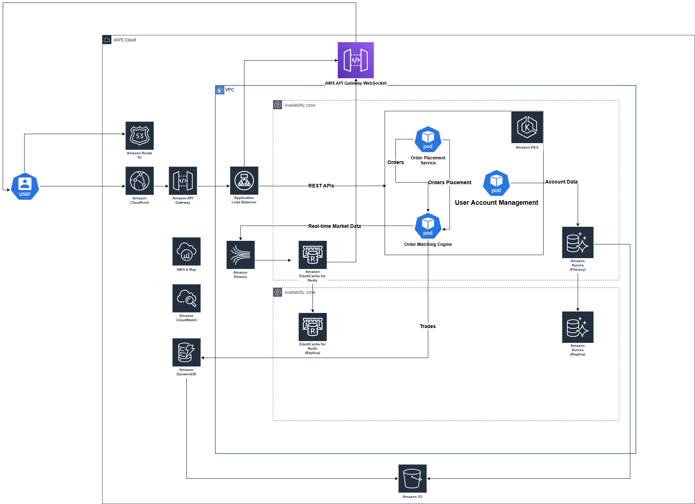

# 🚀 **High-Availability Trading Platform - System Design Report**

## **1. Overview**
This document presents the architecture for a **high-performance, low-latency trading platform** similar to Binance. 

The system follows a **microservices architecture on AWS**, leveraging **EKS (Kubernetes), API Gateway, DynamoDB, Aurora DB, Kinesis, CloudFront, and ElastiCache Redis**.

Due to time constraint, only 3 below features will be covered for this design:

  ✅ **Real-time order matching & execution**.  
  ✅ **Market data streaming for traders**.  
  ✅ **User account management, including balances and transaction history**.

---

## **2. System Architecture Overview**

.

---

## **3. Core Services && Workflow**

### **3.1 Order Placement Service**
📌 **Function:**  
- Receives and validates buy/sell orders from users.  
- Ensures the user has sufficient funds.  
- Forwards valid orders to the **Order Matching Engine**.  

### **3.2 Order Matching Engine**
📌 **Function:**  
- Matches buy and sell orders using a price-time priority algorithm.  
- Executes trades and updates **DynamoDB (trade history)** and **Aurora DB (balances)**.  
- Publishes real-time market data updates.  

### **3.3 User Account Management Service**
📌 **Function:**  
- Manages user authentication, balances, and withdrawals.  
- Handles compliance (KYC) and secure transaction logging. 

### **3.4 Workflow**
🔄 **User Interaction and Request Flow**:  
1. **User Access**: Users access the platform via a browser or app, sending DNS queries to Amazon Route 53, which resolves to Amazon CloudFront for low-latency delivery of static assets and API requests.  
2. **Traffic Distribution**: CloudFront routes static asset requests to the Application Load Balancer (ALB) and API/WebSocket requests to AWS API Gateway.  
3. **API Processing**:  
   - REST API requests (e.g., order placement) are sent to the Order Placement Service in EKS via API Gateway, which forwards orders to the Order Matching Engine.  
   - WebSocket connections enable real-time market data delivery, with AWS API Gateway routing updates from ElastiCache Redis (fed by Kinesis) back to users.  
4. **Data Management**:  
   - The Order Matching Engine stores trades in DynamoDB and streams market data to Kinesis, which caches in ElastiCache Redis for low-latency access.  
   - User account data is managed by the User Account Management Service, querying and updating Amazon Aurora DB, with backups sent to Amazon S3.  
   - Logs from EKS and trade history from DynamoDB are archived in S3 for long-term storage.  
5. **Monitoring and Observability**: Amazon CloudWatch and AWS X-Ray monitor EKS performance and trace WebSocket API requests, ensuring system health and debugging capabilities during high traffic or failures.

## 4. Component Choices

This section details the cloud services chosen for the architecture, their purposes, the rationale behind their selection, alternatives evaluated, and the final decisions justifying their use in the real-time trading platform.

### 4.1 Amazon Route 53
- 📌 **Purpose**: Acts as the DNS service, resolving user requests to the system’s endpoint (CloudFront) for global access.  
- ✅ **Why Chosen**:  
  - Provides low-latency, global DNS resolution, critical for a trading platform with users worldwide.  
  - Ensures high availability with health checks and failover capabilities.  
  - Integrates seamlessly with CloudFront within the AWS ecosystem.  
- 🔄 **Alternatives Considered**:  
  - **Google Cloud DNS**: Offers similar global latency and reliability but lacks native integration with AWS services like CloudFront, complicating the stack.  
  - **Cloudflare DNS**: Fast resolution with DDoS protection, but as an external provider, it reduces control and lacks AWS-specific health checks for ALB.

### 4.2 Amazon CloudFront
- 📌 **Purpose**: Serves as a CDN, distributing static assets and caching API responses to reduce latency for users.  
- ✅ **Why Chosen**:  
  - Caches content at edge locations, minimizing latency for static assets (e.g., UI) critical to user experience.  
  - Scales automatically to handle traffic spikes, such as during market volatility.  
  - Integrates natively with API Gateway for dynamic requests.  
- 🔄 **Alternatives Considered**:  
  - **Cloudflare CDN**: Fast caching and DDoS protection, but external management reduces seamless AWS compatibility.  
  - **No CDN (Direct to ALB)**: Simplifies the architecture but increases latency and lacks caching, degrading performance.  

### 4.3 Application Load Balancer (ALB)
- 📌 **Purpose**: Distributes traffic for static asset requests from CloudFront to backend servers in EKS.  
- ✅ **Why Chosen**:  
  - Enables Layer 7 routing (e.g., path-based) for flexible static asset delivery within EKS.  
  - Scales load across EKS nodes to handle varying user demand.  
  - Provides health checks to ensure traffic reaches only healthy instances.  
- 🔄 **Alternatives Considered**:  
  - **Network Load Balancer (NLB)**: Offers lower latency (Layer 4) but lacks HTTP routing needed for static assets. Suitable for `Websocket` but for simplicity we'll omit it for now.
  - **NGINX (Self-Managed)**: Highly customizable but requires manual scaling and management on EC2.  

### 4.4 Amazon API Gateway
- 📌 **Purpose**: Manages REST API requests and WebSocket connections, routing them from CloudFront to EKS and real-time data feeds.  
- ✅ **Why Chosen**:  
  - Handles REST endpoints (e.g., order placement) with throttling, authentication, and routing to EKS.  
  - Supports WebSocket for real-time market data delivery to users.  
  - Autoscales with traffic, reducing load on EKS.  
- 🔄 **Alternatives Considered**:  
  - **ALB (for APIs)**: Could unify traffic but lacks WebSocket support in older versions and API-specific features.  
  - **Kong API Gateway**: is a lightweight, fast, and flexible cloud-native API gateway but requiring manual management. 

### 4.5 Amazon EKS (Elastic Kubernetes Service)
- 📌 **Purpose**: Hosts microservices (Order Placement Service, Order Matching Engine, User Account Management Service).  
- ✅ **Why Chosen**:  
  - Gold standard for microservices approach: provides container orchestration with scalability, self-healing, and deployment flexibility for microservices. 
  - Autoscales pods to handle trading load variations.  
  - Integrates with ALB, API Gateway, and datastores (DynamoDB, Aurora) within AWS.
- 🔄 **Alternatives Considered**:  
  - **EC2 (Self-Managed)**: Offers full control but requires significant management and lacks auto-scaling. 
  - **Kubernetes (Self-Hosted) on EC2**: Requiring significant effort for maintainance.  

### 4.6 Amazon DynamoDB
- 📌 **Purpose**: Stores trade data generated by the Order Matching Engine.  
- ✅ **Why Chosen**:  
  - NoSQL databases are suitable for applications requiring real-time data processing and analytics.
  - Supports high write throughput for rapid trade ingestion with low latency.
  - Autoscales to handle trade volume spikes (e.g., market surges).  
  - Fits simple key-value trade records (e.g., `trade_id`, `price`).  
 
- 🔄 **Alternatives Considered**:  
  - **Mongo** (self-hosted or `Atlas Mongo`): Relational and ACID-compliant but slower for high-throughput, non-relational trade data.  
  - **Amazon Keyspaces**: Scalable NoSQL but less mature and weaker AWS integration than DynamoDB. 

### 4.7 Amazon Aurora DB
- 📌 **Purpose**: Stores account data for the User Account Management Service.  
- ✅ **Why Chosen**:  
  - Manages relational account data (e.g., users → balances) with ACID compliance for consistency.  
  - Offers high availability via multi-AZ replication, critical for account reliability.  
  - Automates backups to S3, as shown in the architecture.  
  - Provides low-latency access for real-time account management.  
- 🔄 **Alternatives Considered**:  
  - **RDS (MySQL/PostgreSQL)**: Cheaper and relational but slower and less scalable than Aurora.  
  - **DynamoDB**: Fast and scalable but lacks relational support and full ACID compliance.  
  - **MongoDB**: Flexible schema but weaker consistency and no native S3 backup integration. 

### 4.8 AWS Kinesis Data Streams
- 📌 **Purpose**: Streams real-time market data from the Order Matching Engine to ElastiCache Redis.  
- ✅ **Why Chosen**:  
  - Handles continuous, real-time market data flow with low latency.  
  - Scales with data volume (e.g., trade bursts during volatility).  
  - Integrates with Redis for caching and downstream delivery.  
- 🔄 **Alternatives Considered**:  
  - **Kafka (Self-Managed)**: Powerful streaming but requires significant management. 

### 4.9 Amazon ElastiCache Redis
- 📌 **Purpose**: Caches market data from Kinesis for low-latency delivery via WebSocket API.  
- ✅ **Why Chosen**:  
  - Provides sub-millisecond access with in-memory caching, essential for real-time updates.  
  - Supports pub/sub for pushing market updates to WebSocket clients.  
- 🔄 **Alternatives Considered**:  
  - **Memcached**: Lightweight caching but lacks pub/sub or persistence features.  
  - **Self-Hosted Redis**: Full control but requires management overhead.  

### 4.10 Amazon S3
- 📌 **Purpose**: Stores trade history from DynamoDB, logs from EKS, and backups from Aurora.  
- ✅ **Why Chosen**:  
  - Offers 11 9s durability for critical data like trade history and backups.  
  - Cost-effective for long-term storage compared to block storage.  
  - Integrates natively with DynamoDB, EKS, and Aurora as a data sink.  
- 🔄 **Alternatives Considered**:   
  - **Google Cloud Storage**: Similar durability but outside AWS ecosystem.   

### 4.11 Amazon CloudWatch + AWS X-Ray
- 📌 **Purpose**: Monitors EKS performance and traces WebSocket API requests.  
- ✅ **Why Chosen**:  
  - CloudWatch provides metrics (e.g., EKS health, latency) for system monitoring.  
  - X-Ray enables end-to-end tracing (e.g., WebSocket delays) for debugging.  
  - Both integrate natively with all AWS components in the architecture.  
- 🔄 **Alternatives Considered**:  
  - **Prometheus + Grafana**: Richer metrics and visualization but requires self-management.  
  - **Datadog**: Advanced monitoring/tracing but external, costly, and less AWS-native.  
  - **ELK Stack**: Powerful log analysis but no tracing and complex to manage.  

## **5. Scaling Plan for Future Growth**

As the trading platform grows, the system must handle **higher trade volumes, global user expansion, and increased real-time market updates**. Below are the scaling strategies:  

### **5.1 Compute Scaling (Amazon EKS)**
✅ **Horizontal Pod Autoscaling** (HPA) to scale based on CPU/memory usage.  
✅ **Multi-region Kubernetes clusters** for global redundancy.  

### **5.2 API & WebSockets Scaling (API Gateway & WebSocket API)**
✅ **Enable API Gateway caching** to reduce repeated requests.  
✅ **Use AWS Global Accelerator** to route users to the nearest API endpoint.  
✅ **Sharded WebSocket connections** using Redis-based session storage.  

### **5.3 Data Scaling**
✅ **Aurora Global Database** for **multi-region replication**.  
✅ **DynamoDB On-Demand Mode** for **automatic capacity scaling**.  
✅ **Kinesis Enhanced Fan-Out** for higher throughput market data streaming.  

### **5.4 Market Data Scaling**
✅ **Upgrade Redis cluster mode** for higher throughput.  
✅ **Migrate from Kinesis to Apache Kafka** for higher event processing scalability.  

### **5.5 Disaster Recovery & High Availability**
✅ **Multi-AZ deployment for Aurora DB & DynamoDB**.  
✅ **S3 backups + AWS Backup for periodic snapshots**.  
✅ **RTO (Recovery Time Objective) of under 1 minute** using failover strategies.  

---

